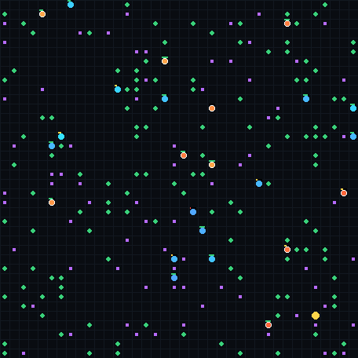

# Evolvarium — Evolving Artificial Life

An open-ended artificial-life simulation: synthetic creatures forage, hunt and
breed in a small ecosystem while their **neural-network brains evolve in real
time**. Watch it live in your browser.



## Run locally

There are three ways to run it, and they all drive the same engine.

**The React build** (`web-react/`) — Next.js 16 + React 19 + Tailwind v4. This is
what ships to <https://bariszorlu.com/Evolvarium>. It imports `public/sim.js`
directly, so the world on the page is the real simulation:
```bash
cd web-react && npm install
npm run dev                                  # then open http://localhost:3000
```

**The static page** (`public/`) — no build step, no dependencies. Any static
server will do:
```bash
cd public && python3 -m http.server 8000     # then open http://localhost:8000
```

`web/server.py` serves the same page and additionally keeps its own world
stepping behind the HTTP API below — that world is what `web/evolve.py` and
`/brains` build on, and what persists champions to disk:
```bash
pip install numpy
python web/server.py        # then open http://localhost:8765
```
Only **numpy** is required. (`torch`, `pygame`, `matplotlib` are optional and
not used by the viewer.)

## What you are looking at

- **Two ways to make a living.** *Herbivores* (cyan→blue) live off plants;
  *carnivores* (orange→red) hunt other families. Nutrition depends on diet — a
  plant barely feeds a specialist predator and a kill barely feeds a grazer — so
  a half-and-half diet is the worst of both, and the population splits into two
  ways of life. Colour is diet, and it shifts as a lineage evolves.
- **Reproduction is earned.** Breeding needs health and costs health, so only
  creatures that actually feed themselves leave offspring. That is the selection
  pressure the whole thing rests on.
- **Real inheritance.** Offspring take their parent's network weights, usually
  recombined with a nearby mate, then mutated. Even the mutation rate is
  heritable, so lineages evolve how fast they evolve.
- **A world with a carrying capacity.** Plants regrow toward a fixed density, so
  grazing depletes a patch and creatures have to keep moving.
- **Predator–prey cycles.** Watch the two population lines: predators boom,
  crash the prey, then crash themselves. If a whole niche is lost, founders
  eventually arrive from elsewhere — the counter in the UI says when.

Controls: play/pause, single step, add plants, reset, speed, mutation, and a
**Neural net ↔ Instinct** toggle so you can see what the evolved brains add on
top of the hard-wired baseline. Click any creature for its life story.

## No training, no end

Evolution happens **live** — there is no separate training step. The world is
open-ended, and the best genomes it has ever produced are saved to
`web/seed_brains.json`, so a restarted server picks up where it left off instead
of starting from noise. `python web/evolve.py` runs the same process headlessly
to seed a fresh deployment.

## Tests
```bash
python tests/test_evolvarium.py     # or: pytest tests/
```
Covers the simulation rules, genome serialisation, the observation fast path
(checked against the reference implementation), and the HTTP API end to end.

## HTTP API

| Route      | What it does                                            |
|------------|---------------------------------------------------------|
| `/`        | the viewer                                              |
| `/stream`  | Server-Sent Events — a snapshot pushed on every tick     |
| `/state`   | the same snapshot as a one-off JSON request (gzipped)    |
| `/control` | `?cmd=play\|pause\|toggle\|step\|reset\|fps\|mutation\|food\|brain` |
| `/brains`  | the current champion genomes, as JSON                   |
| `/healthz` | liveness probe                                          |

## Files
- `web/server.py` — HTTP server, snapshot cache, control API, champion storage
- `web/evolution.py` — the selection rules: earned reproduction, inheritance, the food chain
- `web/ecosystem.py` — genome, mutation, recombination, the instinct policy, colours
- `web/neuro.py` — numpy neural-net brains and bounded weight mutation
- `web/evolve.py` — headless pre-evolution → `web/seed_brains.json`
- `web-react/` — the Next.js build: `app/` the page, `components/ui/` the shared
  interface primitives, `components/site/` the Evolvarium sections,
  `hooks/use-evolvarium.ts` the world and its render loop
- `public/index.html` — the static website: canvas world, hand-drawn charts, creature
  inspector and the explanation of the rules. No build step, no dependencies
- `public/sim.js` — the simulation ported to the browser, so the page runs its
  own world on any static host
- `public/seed_brains.json` — champion genomes shipped with the site
- `ReinLife/` — the underlying grid environment
- `tests/` — the checks above

## Put it on your website
The live site is <https://bariszorlu.com/Evolvarium>: `web-react/` is deployed as
its own Vercel project and the parent site proxies the sub-path to it. Because the
visitor sees `/Evolvarium`, the app carries `basePath: '/Evolvarium'` — see
**DEPLOY.md** for the full wiring.

For a plain copy elsewhere, upload `public/` to any static host — Netlify, Vercel,
GitHub Pages, S3 — and you are done; each visitor gets their own world and there is
nothing to keep running. DEPLOY.md also covers the Python service (managed hosting,
Docker, a VPS walkthrough, the environment variables, and the iframe embed).

Built on the [ReinLife](https://github.com/MaartenGr/ReinLife) environment (MIT).
